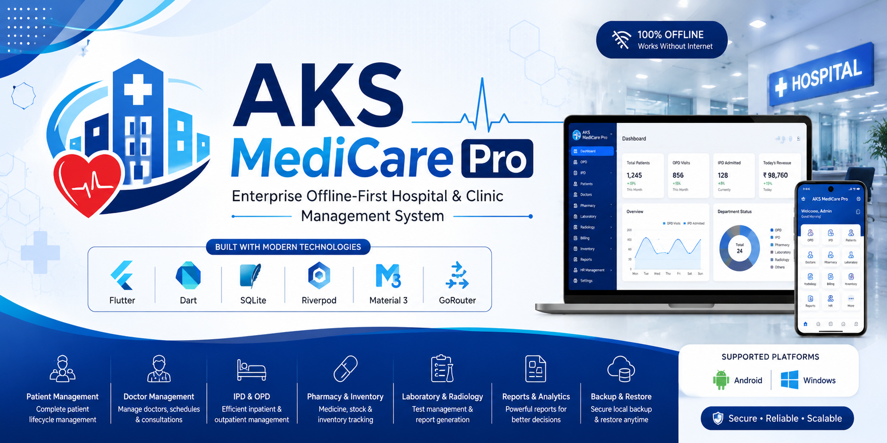
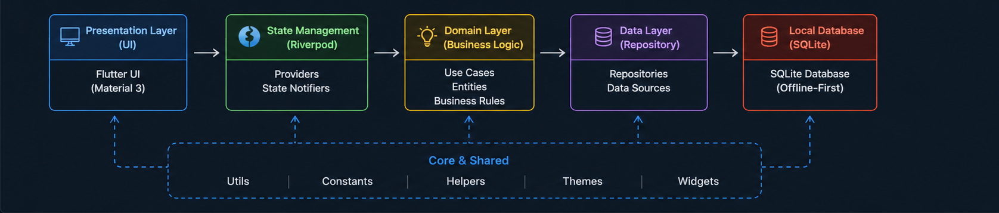
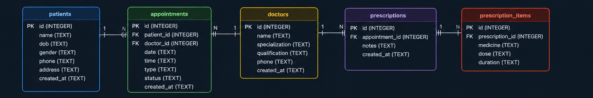

<p align="center">
  
</p>

<p align="center">
  
</p>

<h1 align="center">🏥 AKS MediCare Pro</h1>

<p align="center">
Enterprise Offline-First Hospital & Clinic Management System
</p>

<p align="center">


</p>

---

# 📖 Overview

AKS MediCare Pro is a modern Hospital & Clinic Management System built with Flutter.

The application follows an **Offline-First** architecture, allowing hospitals and clinics to continue working even without an internet connection.

It is designed for:

- 🏥 Hospitals
- 🏥 Multi-Speciality Clinics
- 👨‍⚕️ Doctors
- 🩺 Diagnostic Centers
- 💊 Pharmacies

---

# ✨ Key Features

### 👥 Patient Management

- Patient Registration
- Patient Search
- Patient History
- Emergency Registration

### 👨‍⚕️ Doctor Management

- Doctor Profiles
- Department Allocation
- Consultation Schedule

### 🩺 OPD

- Token System
- Consultation
- Prescription

### 🛏 IPD

- Bed Management
- Admission
- Discharge
- Ward Allocation

### 🧪 Laboratory

- Test Requests
- Test Reports
- Lab History

### 🩻 Radiology

- X-Ray
- CT Scan
- MRI
- Ultrasound

### 💊 Pharmacy

- Medicine Inventory
- Billing
- Stock Tracking
- Purchase Records

### 💳 Billing

- OPD Billing
- IPD Billing
- Laboratory Billing
- Pharmacy Billing

### 📦 Inventory

- Stock Management
- Purchase Management
- Vendor Management

### 👨‍💼 HR

- Staff Management
- Attendance
- Payroll (Planned)

### 📊 Reports

- Daily Reports
- Monthly Reports
- Revenue Reports
- Department Reports

### 🔐 Security

- Secure Login
- Role Based Access
- Offline Database

### ☁ Future Roadmap

- LAN Synchronization
- Cloud Synchronization
- AI Assistant
- Patient Portal
- Doctor Portal

---

# 🛠 Technology Stack

| Technology | Usage |
|------------|-------|
| Flutter | UI Framework |
| Dart | Programming Language |
| Material 3 | Design System |
| Riverpod | State Management |
| GoRouter | Navigation |
| SQLite | Local Database |
| Clean Architecture | Project Structure |
| Repository Pattern | Data Layer |

---

# 📱 Supported Platforms

| Platform | Status |
|----------|--------|
| Android | ✅ |
| Windows | ✅ |
| Linux | 🚧 |
| Web | 🚧 |
| macOS | 🚧 |
| iOS | 🚧 |

---

# 📂 Project Structure

```text
lib/
│
├── app/
├── core/
├── database/
├── features/
│
│   ├── auth/
│   ├── dashboard/
│   ├── patients/
│   ├── doctors/
│   ├── opd/
│   ├── ipd/
│   ├── laboratory/
│   ├── radiology/
│   ├── pharmacy/
│   ├── billing/
│   ├── inventory/
│   ├── hr/
│   └── reports/
│
├── shared/
└── main.dart
```

---

# 📸 Application Preview

| Dashboard | Patient | OPD |
|-----------|---------|-----|
|  |  |  |

| Pharmacy | Reports | Billing |
|----------|---------|----------|
|  |  |  |

> Add screenshots later as the application develops.

---

## 🏗 System Architecture

<p align="center">
  
</p>

---

## 🗄 Database ER Diagram

<p align="center">
  
</p>

---

# 🚀 Getting Started

Clone the repository:

```bash
git clone https://github.com/abhishek027aks/AKS-MediCare-Pro.git
```

Go inside project:

```bash
cd AKS-MediCare-Pro
```

Install packages:

```bash
flutter pub get
```

Run application:

```bash
flutter run
```

---

# 📌 Development Progress

| Module | Status |
|---------|--------|
| Foundation | ✅ |
| Authentication | 🚧 |
| Dashboard | 🚧 |
| Patients | ⏳ |
| Doctors | ⏳ |
| OPD | ⏳ |
| IPD | ⏳ |
| Laboratory | ⏳ |
| Radiology | ⏳ |
| Pharmacy | ⏳ |
| Billing | ⏳ |
| Inventory | ⏳ |
| HR | ⏳ |
| Reports | ⏳ |
| Backup | ⏳ |
| LAN Sync | ⏳ |
| Cloud | ⏳ |
| AI | ⏳ |

---

# 🗺 Roadmap

- ✅ Foundation
- 🚧 Authentication
- ⏳ User Management
- ⏳ Patient Module
- ⏳ Doctor Module
- ⏳ OPD
- ⏳ IPD
- ⏳ Laboratory
- ⏳ Radiology
- ⏳ Pharmacy
- ⏳ Billing
- ⏳ Inventory
- ⏳ HR
- ⏳ Reports
- ⏳ Backup & Restore
- ⏳ LAN Sync
- ⏳ Cloud Sync
- ⏳ AI Integration

---

# 🤝 Contributing

Contributions are welcome.

1. Fork the repository.
2. Create a new branch.
3. Commit your changes.
4. Push the branch.
5. Create a Pull Request.

Please read **CONTRIBUTING.md** before contributing.

---

# 🔒 Security

If you discover a security issue, please report it responsibly.

See **SECURITY.md** for details.

---

# 📜 License

This project is licensed under the MIT License.

See **LICENSE** for more information.

---

# 👨‍💻 Developer

**Abhishek Kumar Singh**

GitHub: https://github.com/abhishek027aks

---

<p align="center">

⭐ If you like this project, don't forget to give it a **Star**.

Made with ❤️ using Flutter.

</p>